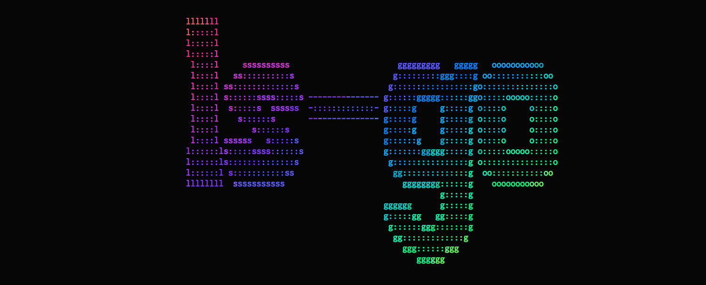

A more colorful, user-friendly implementation of `ls` written in [Go](https://golang.org/).

You want to be able to glean a lot of information as quickly as possible from `ls`.
Colors can help your mind parse the information.
You can configure `ls` to color the output a little bit.
Configuring `ls` is a hassle though, and the colors are limited.

Instead, you can use `ls-go`.
It is highly colored by default.
It has much fewer flags so you can get the behavior you want more easily.
The colors are beautiful and semantic.
A terminal with xterm-256 colors is **required*.*

## Features

- \[x\] Works on Linux, Mac OS X, Windows, FreeBSD and most popular Unix-like systems.
- \[x\] Outputs beautiful, semantic colors by default.
- \[x\] Show paths to symlinks, and explicitly show broken links.
- \[x\] Recurse down sub-directories.
- \[x\] Emojis (if you're into that) and [Nerd Fonts](https://github.com/ryanoasis/nerd-fonts).
- \[x\] Supports producing structured JSON and CSV output (to use with [jq](https://github.com/stedolan/jq) or similar tools).
- \[x\] Full flexibility in choosing which columns / information to show.
- \[x\] Support correct handling of CJK and other wide or invisible Unicode characters in tabular format.
- \[x\] Better default sorting (by basename then extension) and 8 custom sorting methods (more than `ls`, although lacking a few of `ls` sorting methods).
- \[x\] Support several formats for time and file sizes, along with custom Unix's time format and Go's time format.
- \[x\] High compatibility with `ls` command's flags.

## Screenshots


### Nerd Font Support

`ls-go` works with [Nerd Fonts](https://github.com/ryanoasis/nerd-fonts).
Simply add `--nerd-font` or `-n` to get file-specific icons.
This won't work unless you have a Nerd Font installed and selected in your terminal emulator.

## Install

Run `go install github.com/ilius/ls-go@latest`. Or clone the repository and run `go install` within `ls-go` directory.

### Prior Art

This is inspired by [athityakumar/colorls](https://github.com/athityakumar/colorls) and [monsterkodi/color-ls](https://github.com/monsterkodi/color-ls), ported to Go, with various modifications.

## Known Issues

It fails on directories without executable permissions.
The standard `/bin/ls` will also fail when reading non-executable directories,
but only with certain options, like `ls -l`, `ls --color=always` (or `ls -G` on MacOS).
This is because file metadata is needed to determine things like colors,
and directories need to be executable to obtain the metadata of the contents.
For example:

```sh
# create dir without -x permission
$ mkdir -m 644 test

# add a file
$ sudo touch test/foo

# plain `ls` still works
$ /bin/ls test
foo

# but `ls -l` fails
$ /bin/ls -l test

# and so does ls-go
$ ls-go test
```

## Contributing

Contributions are muchly appreciated!
Want to add a glyph for another file type?
Did I forget an edge case?
Is there another option that would be useful?
Submit a PR!
You might want to submit an issue first to make sure it's something I'd want to add though.

## Flags

### `--all`, `-a`

Do not ignore entries starting with `.`

### `--almost-all`, `-A`

Do not list implied `.` and `..`

### `--sort=COLUMN`

Sort by given column instead of basename.\
Supported values:

- `none`
- `name`: sort by full file name (basename and extension)
- `size`
- `time`
- `extension`
- `kind`
- `inode`
- `links`: sort by number of hard links
- `filesize`
- `mode` (numeric file mode, includes permissions and file type)
- `name-len`: length of file name

### `--size`, `-s`

Print the size of each file.

### `--human-readable`, `-h`

With `-l` or `-s` / `--size`, print sizes like `1K`, `234M`, `2G`, etc.

### `--si`

Use metric system for size. Like `--human-readable`, but use powers of 1000, not 1024.

### `--bytes`

Print sizes in bytes.

### `--blocks`

Show allocated number of blocks (like `ls -s`) as a new column.

### `--time=TIME_TYPE`

Change the default of using modification times (`mtime`).

- Access time: `atime`, `access`, `use`
- Change time: `ctime`, `status`, `change`

With `-l`, it determines which time to show.\
With `--sort=time`, sorts by given time (newest first).

### `--time-style=STYLE`

Time/date format with `-l`.\
Can set environment variable `LSGO_TIME_STYLE` to use as default (except for `--json`).

Supported time styles:

- `full-iso` or `full`

  - Go format: `2006-01-02 15:04:05.999999999 Z0700`
  - Unix format: `%Y-%m-%d %H:%M:%S.%N %z`

- `long-iso` or `long`

  - Go format: `2006-01-02 15:04`
  - Unix format: `%Y-%m-%d %H:%M`

- `iso`

  - Go format: `01-02 15:04`
  - Unix format: `%m-%d %H:%M`

- `relative` or `rel`

  - Show relative to current time, for example "1 day, 21:24:23 ago"

- `+` sign followed by a Unix time format (see `man date` or [this link](https://man7.org/linux/man-pages/man1/date.1.html))

### `--full-time`

Shortcut to `-l --time-style=full-iso`.

### `--mtime`, `--modified`

Include modification time (of file contents).

### `--ctime`, `--changed`

Include change time (of file contents or metadata).

### `--atime`, `--accessed`

Include access time.

### `--owner`

Include owner and group.

### `--group`

Show group (without long mode).

### `--no-group`, `-G`

Hide group name (with `-l`).

### `--numeric-uid-gid`, `--numeric`, `-n`

Like `-l`, but list numeric user and group IDs.

### `--perm`, `--mode`

Include permissions for owner, group, and other.

### `--perm-oct`, `--mode-oct`, `--oct`, `--octal-permissions`

Include permissions / mode in octal format.

### `--inode`, `-i`

Print the index number (inode number) of each file.

### `--long`, `-l`

Include size, date, owner, and permissions.

### `--extra-long`

Include all columns.

### `--oneline`, `-1`

Show one file per line.

### `--horizontal`, `-x`

List entries by lines instead of by columns.

### `--vertical`

List entries by columns.

### `--compact`

Try to fit more columns in many-files-per-line modes (vertical/horizontal).

### `--vbar`

Show vertical bars between files in a row, or between columns in `--long` or `--oneline` mode.

### `--quoting-style=STYLE`

Use given quoting style for entry names.\
This overrides `QUOTING_STYLE` environment variable.\
Supported values:

- `literal`
- `shell`
- `shell-always`
- `shell-escape`
- `shell-escape-always`
- `c`
- `escape`
- `none`

### `--literal`, `-N`

Shortcut to `--quoting-style=literal`.\
Print entry names without quoting.

### `--escape`, `-b`

Shortcut to `--quoting-style=escape`.\
Print C-style escapes for nongraphic characters.

### `--directory`, `--list-dirs`, `-d`

List directories themselves, not their contents.

### `--dirs-first`, `--dir-first`, `--group-directories-first`

Show directories before files.

### `--dirs-only`, `--dir-only`, `--only-dirs`

Only show directories.

### `--files`

Only show files.

### `--has-mode=OCTAL_MODE`

Only show items with mode(permissions) that contains the given octal mode.

### `--dereference`, `-L`

When showing file information for a symbolic link, show information for the file the link references rather than for the link itself.

### `--links`

Show paths for symlinks.

### `--link-rel`

Show symlinks as relative paths if shorter than absolute path.

### `--reverse`, `-r`

Reverse order while sorting.

### `--stats`

Show statistics.

### `--icons`

Show folder icon before directory name.

### `--nerd-font`

Show nerd font glyphs before file names.

### `--recursive`, `-R`

Traverse all directories recursively.

### `--find=PATTERN`

Filter items with a regexp.

### `--color=`

Accepted values:

- `--color=always`, `--color=yes`, `--color=y`, `--color=`
- `--color=never`, `--color=no`, `--color=n`
- `--color=auto` (default): enables colors only when stdout is connected to a terminal

Whether or not to colorize the output.\
`auto` means if stdout connected to a terminal.

### `--header`

Add a header line with:

- `-l` or `--long`
- `-1` or `--oneline`
- `--json`
- `--json-array` (shows header by default)
- `--csv` (shows header by default)

### `--no-header`

Do not add a header line with `--csv` or `--json-array`.

### `--json`

Print JSON-encoded lines instead of tables (one object per line).

### `--json-array`

Print JSON-encoded lines instead of tables, one array per line.

### `--ascii`

With `--json` and `--json-array`, escape Unicode characters and ensure output is ASCII.\
In tabular/normal mode, apply this only to file names.

### `--csv`

Print a CSV table.

### `--html`

Print HTML.

### `--read-json`

Read JSON-encoded lines from stdin, instead of looking at filesystem and path arguments.

Example usage with `jq`:

```
ls-go -l --json | jq -cM 'select(.size > 5000)' | ls-go -l --read-json
```

which is equivalent to

```
ls-go -l --where 'size > 5000'
```

### `--minsize=SIZE`

Minimum file size (in bytes).

### `--maxsize=SIZE`

Maximum file size (in bytes).

### `-t`

Shortcut to `--sort=time`.\
Sort by time, newest first.\
See [--time](#--timetime_type).

### `-c`

Shortcut to `--time=ctime`.\
With `-lt`: sort by, and show, ctime (time of last modification of file status information).\
With `-l`: show ctime and sort by name.\
Otherwise: sort by ctime, newest first.

### `-u`

Shortcut to `--time=use`.\
With `-lt`: sort by, and show, access time.\
With `-l`: show access time and sort by name.\
Otherwise: sort by access time, newest first.

### `-U`

Shortcut to `--sort=none`.\
Do not sort (list entries in directory order).

### `-S`

Shortcut to `--sort=size`.\
Sort by file size, largest first.

### `-X`

Shortcut to `--sort=extension`.\
Sort alphabetically by entry extension.

### `--colors-json`

Print colors in json format and exit.

### `--help-md`

Show help in markdown format.

### `--help`

Show usage message.

### `--version`

Show version.
